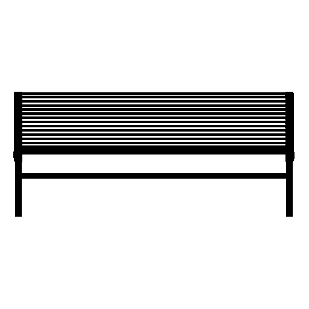
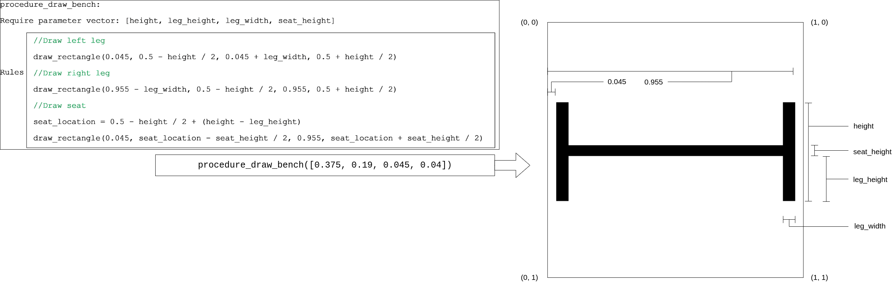
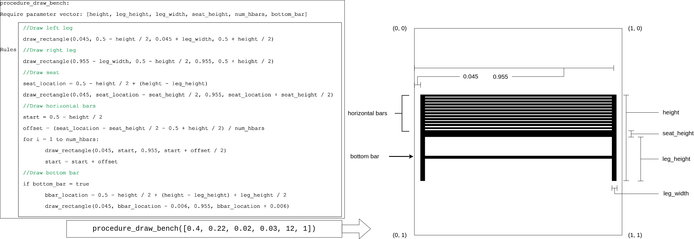
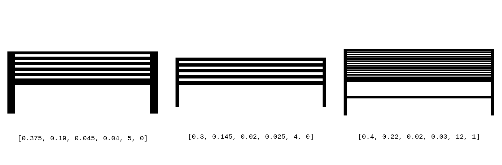
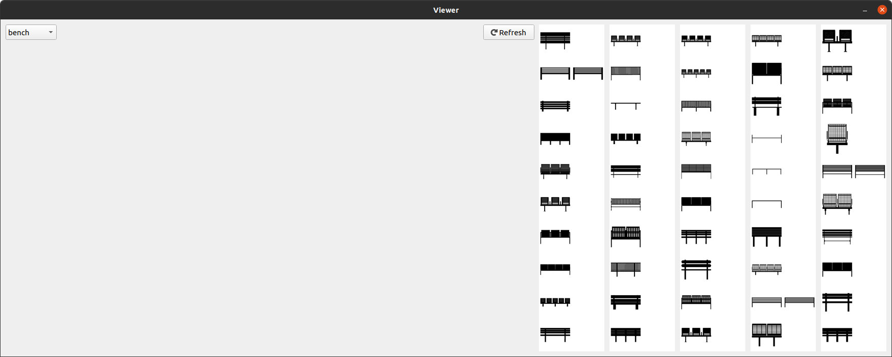
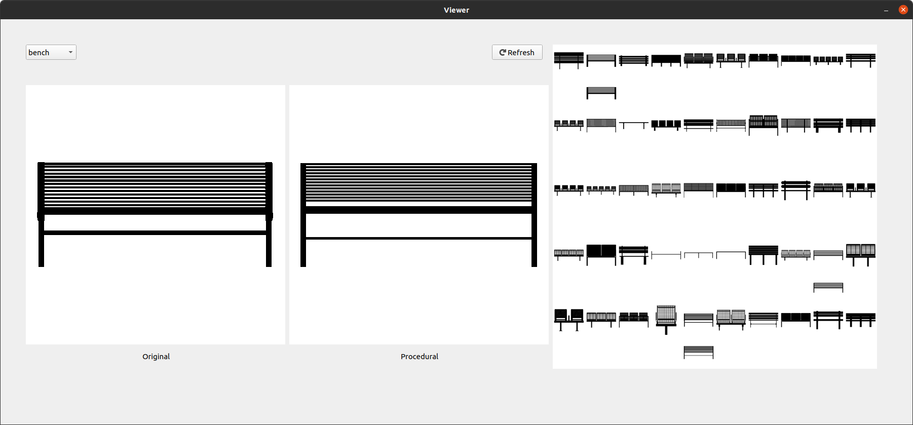

# Overview

In this experiment, we ask you to write computer code to create a set of 2D shapes in a procedural manner. The goal is to create shapes that are as similar as possible to the shapes given in the study. The shapes are simply of black color on a white background. At the end of the study, we will ask you to participate in a short survey and answer a few follow-up questions.

# Introduction to Procedural Modeling

Procedural modeling of 2D shapes is the process of creating 2D shapes from a set of rules (aka the procedure) that are configurable with parameters. Take for example the figure below which is a silhouette of a bench.



We can define a simple procedure where we draw basic 2D shapes on an empty background and compose a shape that looks like a very simple bench with only the legs and the seat. See the figure below for an example.



It can be seen that the procedure is defined as a set of rules for drawing basic shape for various parts of the bench. The procedure assumes the background to be a unit square. In this example, the procedure only uses rectangle as basic shape, however other basic shapes such as circles or polygons can easily be used. The method for drawing rectangle takes the coordinates of the upper left and the lower right corner of the rectangle. The procedure accepts a vector of parameters that govern the placement and size of the basic shapes created by the rules. In this example, the vector has 4 elements. One may find it useful to think of procedural modeling as creating functions with parameters where the function body is composed of rules and the parameters are the values for the rules to act on. We can add more complexity to both the procedure and the parameter vector in order to model more complex shapes. For example, see the figure below where the procedure is extended with more rules and the parameter vector has more elements in it.



It is also worth mentioning that the elements of the parameter vector can be different types. The elements can be scalars or continuous values, e.g. ```height```, ```leg_height```, ```leg_width``` and ```seat_height``` in the figure above. They can also be integers, i.e. they only take on discrete values, such as ```num_hbars```. In addition, the elements can also be binary, i.e. they can be either true or false, such as ```bottom_bar```. 

Once we have the semantics of the parameter vector (what each element represents and their type) and the rules in the procedure defined, we can assign values to the elements in the parameter vector and pass it to the procedure so that the shape created by the procedure matches with the intended shape. In other words, we can adjust the parameter vector so that the resulting bench has the desired look. The figure below shows benches with the example procedure and various parameter vectors.



To summarize, we can define a procedural model by going through the following three steps.
1. Defining the parameter vector, i.e. defining how many elements there are in the parameter vector, what the elements represent etc.
2. Defining the procedure, i.e. creating rules for various parts of the shape in the procedure.
3. Specifying the actual parameters for different shapes, i.e. passing an actual parameter vector to the procedure to create a specific shape.

# Package requirements
The project is implemented using Python 3.9 and depends on the following python packages.
```
pyqt5~=5.15.6
pillow~=8.4.0
```

# Running the program
In order to run the program, navigate to the root directory of the downloaded repository and run
```python main.py```

# The user interface
Running the program opens the user interface which you can interact with.



There are two classes of shapes in this study; bench and chair. The bench class serves as an example you can use as reference while you create procedural model for the chair class. You can switch between the bench class and the chair class using the drop-down menu in the top left corner. On the right-hand side of the interface, there is a summary panel where you can see thumbnails of all the shapes from the selected class, arranged in 5 columns. There are a total of 50 shapes in each class. As example, three shapes from the bench class are already defined procedurally which are shown on the right side of their corresponding example shapes.  
You can click on any shape from the summary pane and see the enlarged images on the left-hand side of the interface. This helps you do a side by side comparison between the original shape and the procedural shape and inspect how closely they resemble each other. You can edit the code while the interface is running and see the results of your work by clicking the refresh button.



# Creating the procedural model
As explained previously, creating a procedural model is a three-step process. In order to implement these steps, you will edit the code in ```chair.py```. You can always look at ```bench.py``` where example implementation for these steps are already provided and can be helpful when you need some concrete examples.

1. **Define the parameter vector:** You will implement this in the ```setup_parameter_vector``` method. You will define the structure of the parameter vector by defining each element of the vector, one at a time. In order to define a vector element, call the following method.
    ```
   self.add_parameter_vector_element
               (name_of_parameter,             # String, specifying name of the parameter
               type_of_parameter,              # 's', 'i' or 'b', for scalar, integer or binary respectively
               minimum_allowable_value,        # Ignore if binary parameter
               maximum_allowable_value)        # Ignore if binary parameter
    ```
   As you can see, up to four arguments can be passed to the ```self.add_parameter_vector_element``` method when defining an element. The first argument is the name assigned to the element. The second argument defines the type of the parameter, and is any of ```‘s’```, ```‘i’``` or ```‘b’``` (short for scalar, integer and binary, respectively). The third and the fourth argument is the minimum and maximum allowable value of the parameter (these are optional when adding binary elements, since the min and max values are 0 and 1). For example, the following line of code will add a scalar element named ```test_element``` to the parameter vector with the minimum value of 0.0 and maximum value of 0.5.
```self.add_parameter_vector_element('test_element', 's', 0.0, 0.5)```

2. **Define the procedure:** You will implement this in the ```procedure``` method. You will draw basic shapes on an empty canvas and combine them to draw different types of chairs. Each basic shape can represent various parts of the chair, such as legs, back and seat. You will use the values in the parameter vector to control the attributes of the basic shapes such as location and size. In order to get the value of a particular vector element, you can use ```param_vector.get_parameter('element_name')``` where ```element_name``` is the name you assigned to that particular element. For drawing basic shapes, here is a list of methods you can choose from.  
   - ```self.arc(self, xy, start, end)```: Draws an arc (a portion of a circle outline) between the ```start``` and ```end``` angles, inside the given bounding box ```xy``` (a 4-tuple). The bounding box is defined with respect to a unit square where top left is (0, 0), top right is (1, 0), bottom left is (0, 1) and bottom right is (1, 1).
   - ```self.chord(self, xy, start, end)```: Same as arc(), but connects the end points with a straight line.
   - ```self.ellipse(self, xy)```: Draws an ellipse inside the given bounding box.
   - ```self.line(self, xy)```: Draws a line between the coordinates in ```xy```.
   - ```self.pieslice(self, xy, start, end)```: Same as arc, but also draws straight lines between the end points and the center of the bounding box.
   - ```self.point(self, xy)```: Draws points (individual pixels) at the given coordinates.
   - ```self.regular_polygon(self, bounding_circle, n_sides, rotation=0)```: Draws a regular polygon inscribed in ```bounding_circle```, with ```n_sides```, and rotation of ```rotation``` degrees. The bounding circle can also be defined with respect to the unit square described before.
   - ```self.rectangle(self, xy)```: Draws a rectangle.
   - ```self.rounded_rectangle(self, xy, radius=0)```: Draws a rounded rectangle.
3. **Specify the actual parameter vectors:** Finally, in order to create a specific chair shape, you will need to specify the parameter values for the corresponding shape. This is implemented in the ```specify_parameter_vectors``` method. Use ```self.assign_parameter_vector_to_shape(index, vector)``` to assign the parameter vector ```vector``` to the shape indexed at ```index```. For instance, you may wish to assign the parameter vector ```[0.1, 5, 0]``` for the first chair (indexed at 0). This can be done by making the call ```self.assign_parameter_vector_to_shape (0, [0.1, 5, 0])```. Note that the order of the elements in the parameter vector should be the same order you added them in the ```setup_parameter_vector``` method.

As you work on creating the procedural model, your goal is to develop it as far as possible within the allotted time, so that it as able to represent as many shapes as possible.

# Debrief
Once you are finished with your work, please visit <https://carletonu.az1.qualtrics.com/jfe/form/SV_dmMJN4mfpFP7w8u> where you will find a short survey that will help us record your experience and document the findings from this study.